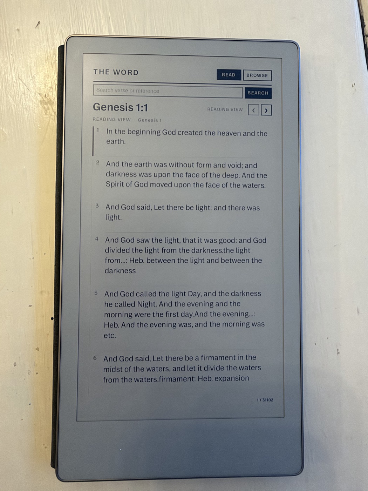
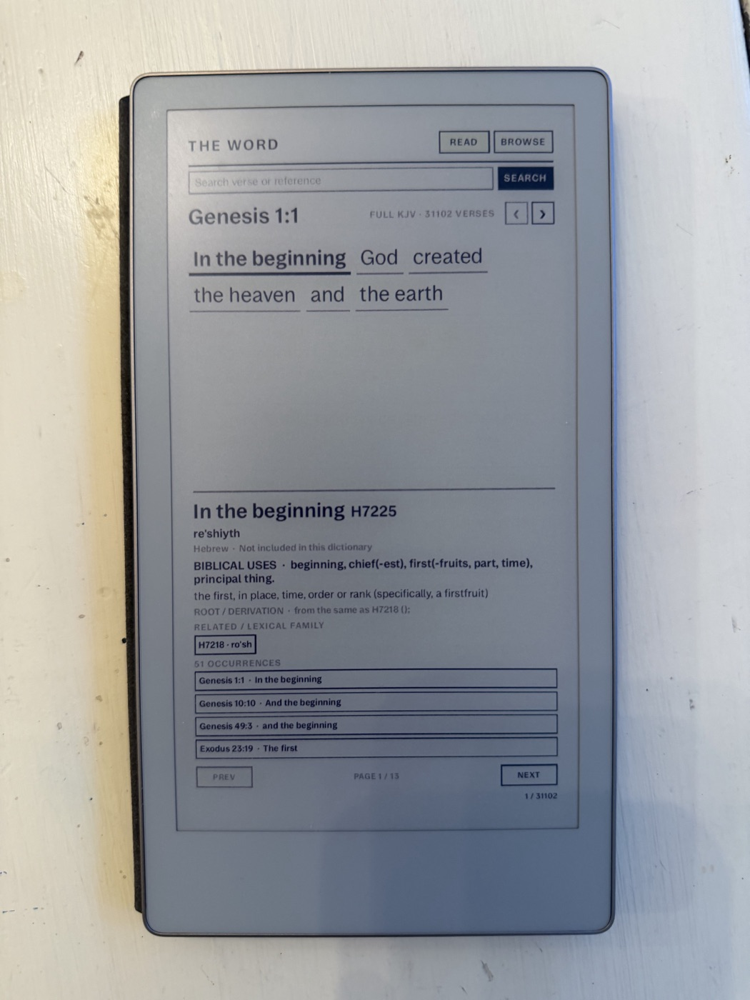
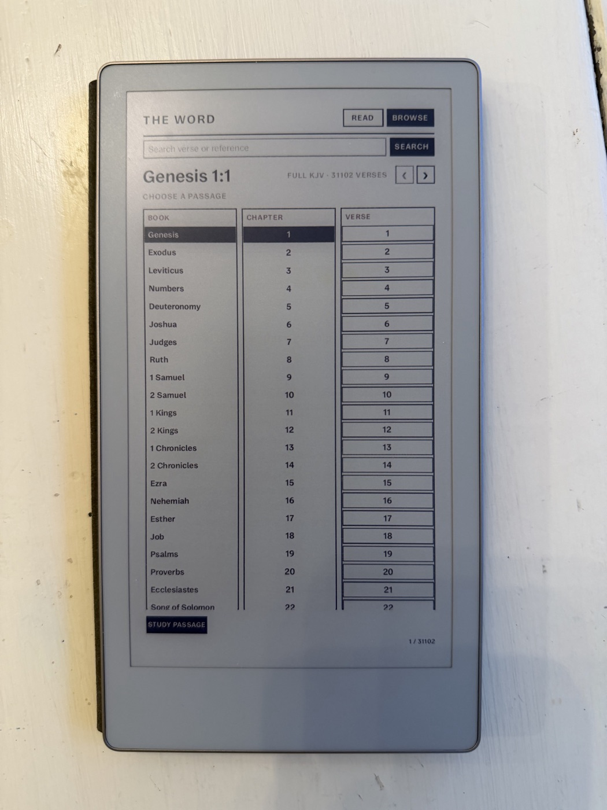

# The Word — reMarkable Paper Pro Move

`The Word` is a native QML offline KJV word-study app for the Paper Pro
Move. The current build includes:

- the full 66-book KJV corpus (31,102 verses)
- individual tappable word tokens
- Strong's number, original-language lemma, transliteration, gloss,
  derivation, and definition
- related lexical-family links that jump to another tagged word in the verse
- verse search, chapter reading, and book/chapter/verse browsing
- page-sized Strong's occurrence lookup with offline navigation
- a desktop preview and screenshot mode
- a frontend/backend AppLoad split with a compact bundled corpus

## Screenshots

These photos show the app running on a reMarkable Paper Pro Move:

<table>
  <tr>
    <td align="center"><br><sub>Chapter reading view</sub></td>
    <td align="center"><br><sub>Word study and Strong's lookup</sub></td>
    <td align="center"><br><sub>Book, chapter, and verse browser</sub></td>
  </tr>
</table>

## Install a release

The easiest install is a release zip. After downloading and unzipping it on a
machine with SSH access to the tablet:

```bash
RM_HOST=10.11.99.1 ./install.sh
ssh root@10.11.99.1 'systemctl restart xochitl'
```

Then open the AppLoad sidebar and tap **The Word**. The restart is required
because AppLoad reads manifests, icons, and frontend bundles when xochitl
starts.

## Preview

The machine used to author this app does not have Qt installed. On a machine
with Qt 6.4 or newer:

```bash
brew install qt ninja
./preview.sh
```

That builds and opens the interactive desktop preview. For an exact-size Move
screenshot:

```bash
./preview.sh --panel 954x1696 --shot /tmp/word-study-move.png
open /tmp/word-study-move.png
```

## Building and deploying from source

The release build needs Docker and an SDK no newer than the tablet's Qt
version. The normal build uses the cached Paper Pro Move SDK:

```bash
IMAGE=rmpp-sdk-5.7 ./build.sh
./package.sh
RM_HOST=10.11.99.1 ./deploy.sh
```

`package.sh` writes `dist/word-study.zip`, which contains a standalone
installer and the offline Bible data. See [docs/PLATFORM.md](docs/PLATFORM.md)
for the device, SDK, AppLoad, and e-ink constraints behind these commands.

## Data bundle

`tools/import_crosswire.py` converts the CrossWire KJV OSIS source into
`data/bible.bin`. The binary preserves the KJV verse text, tagged word groups,
and embedded Strong's IDs. `data/strongs.json` supplies the Strong's Hebrew and
Greek dictionary entries, including derivation and KJV usage fields. Both files are copied into the AppLoad bundle by
`build.sh` and deployed beside the backend.

The state shape is:

```text
verse → word token → Strong's ID → lexicon entry → related IDs
```

The source and attribution details are in `data/SOURCES.md`.

## License

The application code and launcher icon are MIT licensed. The bundled Bible and
Strong's data retain the source licenses and attributions documented in
`data/SOURCES.md`.
